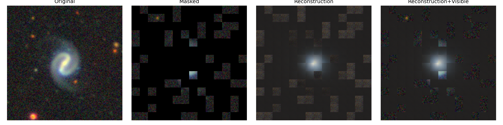
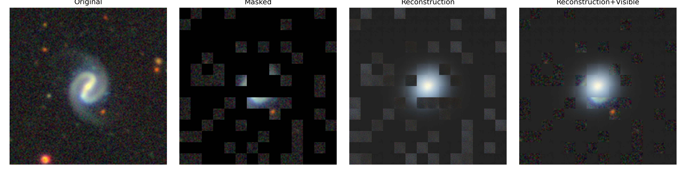
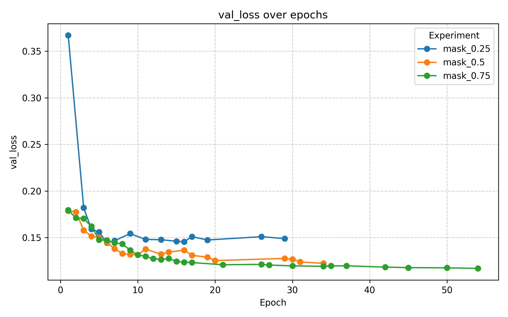
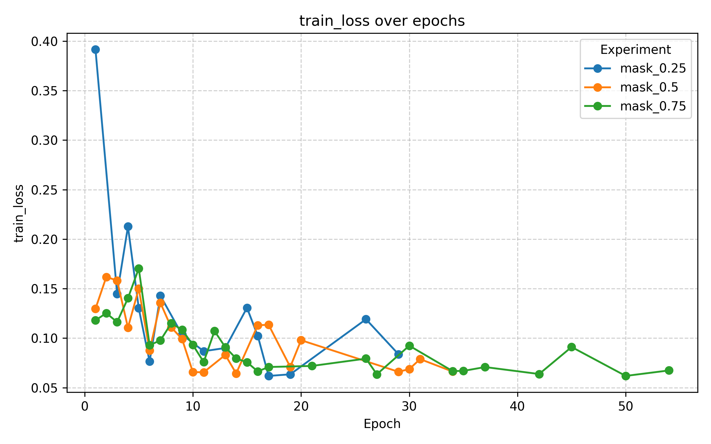
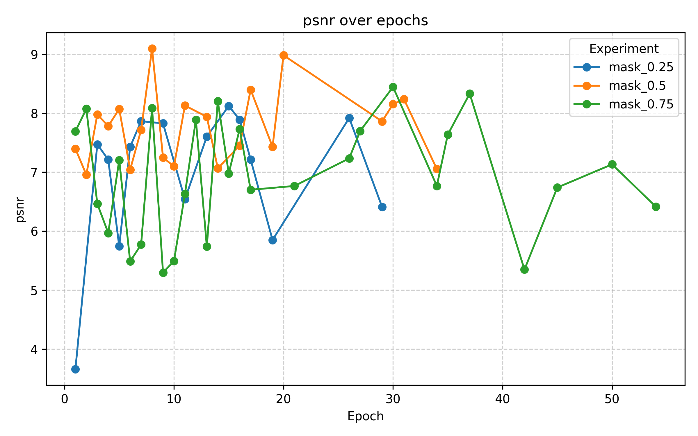

# 🛰️ Galaxy-MAE: Masked Autoencoders on Galaxy10-Decals

This repository implements **Masked Autoencoders (MAE)** on the **Galaxy10-Decals** dataset.  
It includes two main stages:

1. **Self-Supervised Pretraining** — learn visual representations by reconstructing masked image patches.  
2. **Linear Probing** — evaluate representation quality by training a linear classifier on top of the frozen encoder.

---

## 📂 Repository Structure

- **`mae_model.py`**  
  Core MAE architecture:
  - `PatchEmbed`: image → patch tokens  
  - `MAEEncoder`: Vision Transformer encoder (trained on visible patches)  
  - `MAEDecoder`: lightweight decoder (reconstructs masked patches)  
  - `MAE`: full pipeline (patchify → mask → encode → decode → loss)

- **Training scripts**  
  - `train_mae.py`: self-supervised pretraining  
  - `linear_probing_train.py`: freeze encoder and train a linear classifier  

- **Utilities**  
  - `reconstruct.py`: visualize masked images and reconstructions  
  - `plot_logs.py` / `plot_multi_logs.py` / `plot_linear_probing.py`: visualize loss curves and metrics  

- **Outputs**  
  - `runs/mae_pretrain/`: checkpoints, logs, configs for pretraining  
  - `linear_probe_logs/`: logs and checkpoints for linear probing  

## ⚙️ Environment Setup

```bash
module purge
module load cuda

python -m venv venv
source venv/bin/activate

pip install --upgrade pip
pip install torch torchvision timm datasets tqdm matplotlib pandas pillow
```
---

## 🧠 MAE Pretraining

### Run a quick debug experiment
```bash
module purge
module load cuda
source venv/bin/activate
cd galaxy_mae   # ⚠️ replace with your project path

python train_mae.py \
  --epochs 3 \
  --batch_size 16 \
  --exp_name debug \
  --mask_ratio 0.75
```

### Workflow
1. Split each input image into fixed-size patches (16×16).  
2. Randomly mask a high proportion (e.g. 75%).  
3. Encode visible patches with a Vision Transformer.  
4. Decode to reconstruct all patches.  
5. Compute reconstruction loss **only on masked patches**.  

### Outputs
Each pretraining run produces:
- `ckpts/best_encoder.pth`: encoder checkpoint (for probing/fine-tuning)  
- `ckpts/final.pth`: full encoder-decoder checkpoint  
- `train_log.csv`: logs with `epoch,train_loss,val_loss,lr,mask_ratio,wall_time`  
- `config.json`: configuration of the run  

### Run multiple mask ratios
```bash
sbatch scripts/mask_ratio_test.sh
```
- `scripts/mask_ratio_test.sh` launches 3 jobs (mask ratios 0.25, 0.5, 0.75).

## 🌌 Reconstruct Result




## 📊 Training Curves




---

## 📊 Linear Probing

### Purpose
Linear probing evaluates how well the pretrained encoder learned useful features.  
The encoder is **frozen**, and only a linear classification head is trained.

### Single Run
```bash
python linear_probing_train.py \
  --ckpt runs/mae_pretrain/mask_0.75/ckpts/best_encoder.pth \
  --epochs 50 \
  --batch_size 64 \
  --lr 1e-3 \
  --wd 0.05
```
### Batch run (three ratios)
``` bash
sbatch scripts/linear.sh
```
### Workflow
1. Load the frozen encoder from `best_encoder.pth`.  
2. Attach a linear classifier (`LinearProbe`).  
3. Train only the classifier using galaxy labels (10 classes).  
4. Report accuracy on the test set.  

### Outputs
Each probing run saves:
- `linear_probe_best.pth`: best linear probe checkpoint  
- `train_log.csv`: logs with `epoch,train_loss,val_loss,train_acc,val_acc`  

---

## ✅ Key Takeaways

- **Pretraining** is unsupervised: the model reconstructs galaxies without labels.  
- **Linear probing** measures how good the representations are for classification.  
- Use **`best_encoder.pth`** (not `final.pth`) for probing.  
- Multiple mask ratios (0.25, 0.5, 0.75) can be compared to study representation quality.  

---

## 📈 Metrics

- **Pretraining**:  
  - Train Loss (reconstruction)  
  - Validation Loss (reconstruction, used for early stopping)  

- **Linear Probing**:  
  - Train Loss & Accuracy  
  - Validation Loss & Accuracy  

---

## 🖼️ Visualization

- **Reconstructions**: compare original, masked, reconstructed, and recon+visible images.  
- **Training curves**: plot loss and accuracy across epochs.  
- **Multi-experiment overlays**: compare different mask ratios on the same plot.  

---

This project demonstrates how **self-supervised pretraining with MAE** combined with **linear probing** provides a systematic way to evaluate learned visual features on astronomy datasets.